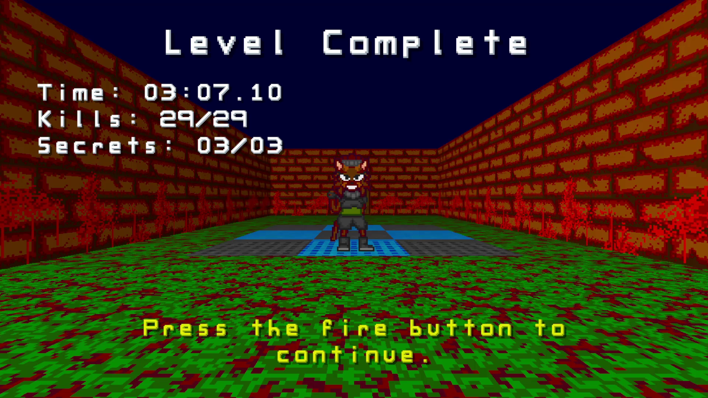

# Total Invasion 22

A (VERY WIP) remake of Total Invasion II using a custom engine built on Go with a pinch of C.

This is a DOOM inspired first person shooter with fast gameplay, unusual weapons, and a
bright, cartoonish art style.

## Running

Use `go build ./cmd/total-invasion-22` at the root of the repository to build the main game executable.

## Screenshots

